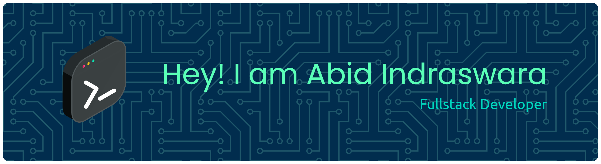

## Hi there, I'm Abid Indraswara 

🌱 I’m currently learning about AI, Data Scientist, Machine Learning, Data Analytics, SQA, Web App and Android App.

💼 I’m currently working as Product Quality Assurance Business Intelligence.

---

### 🌐 Socials

---

### 🚀 Skills

Learn and familiar with the following technologies

##### Programming Languages

       

##### Frameworks

                        

##### Database

      

##### AI Engine

  

##### Production Ready

      

##### Design

   

---

### 📊 My Github Stats

 
 

---

### 🏆 GitHub Trophies

---

### 🔝 Top Contributed Repo

---

<picture>
  <source media="(prefers-color-scheme: dark)" srcset="https://raw.githubusercontent.com/Abito21/Abito21/output/pacman-contribution-graph-dark.svg">
  <source media="(prefers-color-scheme: light)" srcset="https://raw.githubusercontent.com/Abito21/Abito21/output/pacman-contribution-graph.svg">
  
</picture>

---

